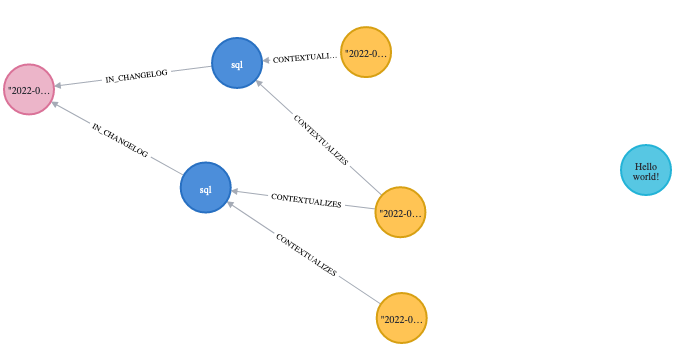

# Migrate to Liquibase

Liquigraph has reached EOL and is now superseded by the [Neo4j plugin for Liquibase](https://neo4j.com/labs/liquibase/).

Since this is a one-off task, the migration utility is only exposed through the CLI and the Maven plugin.

!!! warning
    The migration utility does **not** support Liquigraph [postconditions](reference.md#postconditions).
    If you are in such a situation, please [raise an issue](https://github.com/liquibase/liquibase-neo4j/issues/new?title=Need%20help%20with%20migration%20of%20Liquigraph%20postconditions). We will take it from there.

## Prerequisites

This requires the latest version of [Liquigraph](./download.md) (at least 4.0.6).

## 🎬 Action!

Adapt the following examples to your setup (path to change log, URI, username, password).
You may also add comma-separated execution contexts with `--execution-contexts` if needed.

!!! warning
    **The `--delete` flag removes the entire Liquigraph history graph** from your database.
    Use it like below once you validated the migration works for you.


=== "Homebrew users"

    ```shell
    liquigraph migrate-to-liquibase \
        --changelog liquigraph.xml \
        --url jdbc:neo4j:bolt://localhost \
        --username neo4j \
        --password s3cr3t \
        --delete \
        # resulting Liquibase file
        --file ./liquibase.xml
    ```

=== "CLI / Windows users"

    ```shell
    ./liquigraph.bat migrate-to-liquibase \
        --changelog liquigraph.xml \
        --url jdbc:neo4j:bolt://localhost \
        --username neo4j \
        --password s3cr3t \
        --delete \
        # resulting Liquibase file
        --file ./liquibase.xml
    ```

=== "CLI on Unix"

    ```shell
    ./liquigraph.sh migrate-to-liquibase \
        --changelog liquigraph.xml \
        --url jdbc:neo4j:bolt://localhost \
        --username neo4j \
        --password s3cr3t \
        --delete \
        # resulting Liquibase file
        --file ./liquibase.xml
    ```

=== "Maven plugin"

    You first need to configure your `pom.xml` as follows:

    ```xml
    <plugin>
        <groupId>org.liquigraph</groupId>
        <artifactId>liquigraph-maven-plugin</artifactId>
        <version>{{ versions.latest_4x }}</version>
        <configuration>
            <changelog>liquigraph.xml</changelog>
            <!-- resulting Liquibase file -->
            <liquibaseFileName>liquibase.xml</liquibaseFileName>
            <deleteLiquigraphGraph>true</deleteLiquigraphGraph>
            <jdbcUri>jdbc:neo4j:bolt://localhost</jdbcUri>
            <username>neo4j</username>
            <password>s3cr3t</password>
        </configuration>
    </plugin>
    ```

    Now run: `mvn compile liquigraph:migrate-to-liquibase`.
    The resulting file is in `target/`.


You should see that a new file named `liquibase.xml` has been generated with `changeSet` elements inside.
Here is the example of an output based on [a migration tutorial](https://github.com/fbiville/liquigraph-to-liquibase/).
```xml
<?xml version="1.1" encoding="UTF-8" standalone="no"?>
<databaseChangeLog xmlns="http://www.liquibase.org/xml/ns/dbchangelog" xmlns:ext="http://www.liquibase.org/xml/ns/dbchangelog-ext" xmlns:pro="http://www.liquibase.org/xml/ns/pro" xmlns:xsi="http://www.w3.org/2001/XMLSchema-instance" xsi:schemaLocation="http://www.liquibase.org/xml/ns/dbchangelog-ext http://www.liquibase.org/xml/ns/dbchangelog/dbchangelog-ext.xsd http://www.liquibase.org/xml/ns/pro http://www.liquibase.org/xml/ns/pro/liquibase-pro-4.1.xsd http://www.liquibase.org/xml/ns/dbchangelog http://www.liquibase.org/xml/ns/dbchangelog/dbchangelog-4.1.xsd">
    <changeSet author="florent-biville" context="foo,bar" id="sentence-initialization" objectQuotingStrategy="LEGACY" runOnChange="true">
        <sql splitStatements="true" stripComments="false">CREATE (n:Sentence {text:"Hello monde!"})</sql>
    </changeSet>
    <changeSet author="florent-biville" context="bar,baz" id="sentence-correction" objectQuotingStrategy="LEGACY" runAlways="true">
        <preConditions onError="HALT" onFail="HALT" onSqlOutput="IGNORE">
            <or>
                <sqlCheck expectedResult="true">RETURN false AS result</sqlCheck>
                <and>
                    <sqlCheck expectedResult="true">RETURN true AS result</sqlCheck>
                    <sqlCheck expectedResult="true">RETURN true AS result</sqlCheck>
                </and>
            </or>
        </preConditions>
        <sql splitStatements="true" stripComments="false">MATCH (n:Sentence {text:"Hello monde!"}) SET n.text="Hello world!"</sql>
    </changeSet>
</databaseChangeLog>
```

This is the Liquibase XML equivalent of Liquigraph XML migrations.

Running the query `MATCH (n) RETURN n` should yield a history graph similar to this:



## 🥳 Congratulations!

You are now a [Liquibase](https://liquibase.org/) user!

⭐️ Feel free to star the [Liquibase Neo4j repository](https://github.com/liquibase/liquibase-neo4j). 

📕 You can also follow the embedded tutorial in the repository [README](https://github.com/liquibase/liquibase-neo4j/blob/main/README.md#quickstart)
to learn more about Liquibase and the Neo4j plugin.

{!includes/_abbreviations.md!}
