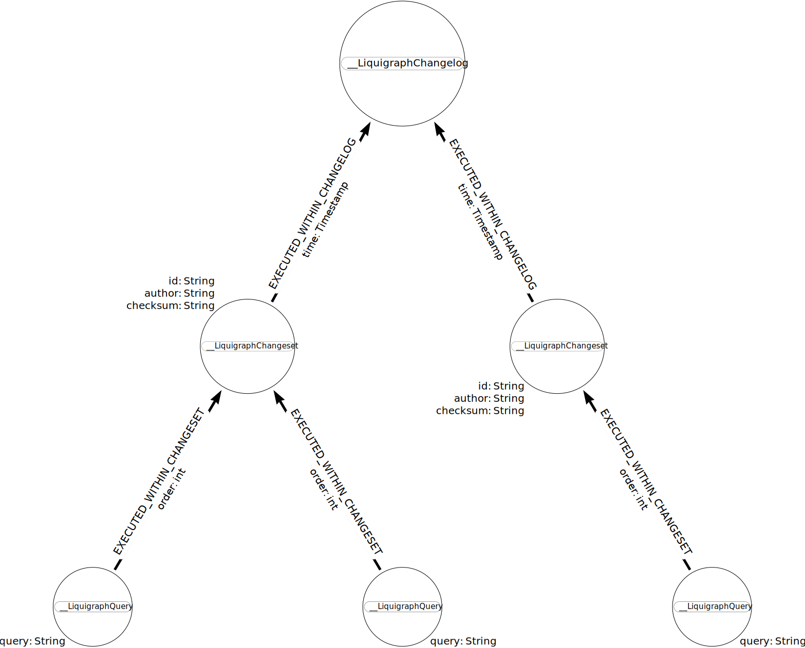

# Reference

## Concepts

### Change logs

A **change log** is a collection of **change set**s.

Liquigraph needs to be configured with a single change log, sometimes known as main change log.

```xml linenums="1"
<?xml version="1.0" encoding="UTF-8"?>
<changelog xmlns:xsi="http://www.w3.org/2001/XMLSchema-instance"
           xsi:noNamespaceSchemaLocation="https://www.liquigraph.org/schema/1.0/liquigraph.xsd">
    <!-- minimal change log -->
</changelog>
```

A change log file may include other relative change log files and/or define change sets.
Liquigraph will pre-process such inclusions and resolve them to a single change log document.

The following example change log assume this folder structure:

```shell
.
├── 1.0
│   └── changelog.xml
├── 2.0
│   └── changelog.xml
└── changelog.xml
```

```xml linenums="1"
<?xml version="1.0" encoding="UTF-8"?>
<changelog xmlns:xsi="http://www.w3.org/2001/XMLSchema-instance"
           xsi:noNamespaceSchemaLocation="https://www.liquigraph.org/schema/1.0/liquigraph.xsd">
    
    <import resource="1.0/changelog.xml" />
    <import resource="2.0/changelog.xml" />
</changelog>
```

In that example, the change sets of `1.0/changelog.xml` will be executed in declaration order, 
before the ones of `2.0/changelog.xml`. 

!!! info
    Contrary to Liquibase, Liquigraph does not support folder import.

### Change sets

**Change set**s are uniquely identified by the combination of ID and author.

!!! note
    IDs must remain unique within a change log **file**, this is a requirement of the XML specification.
    ID duplicates are allowed across files.

Change sets are globally ordered by their execution (transaction) timestamp.

They define **at least 1** Cypher query.

!!! warning
    Liquigraph only supports XML. As a consequence, any query that includes an XML entity (such as `<` or `>`) needs to
    be surrounded with `<![CDATA[` and `]]>` blocks.

    ❌ **Invalid** change set:
    ```xml linenums="1"
    <changeset id="fix-minimum-value" author="florent.biville">
       <query>MATCH (n:SomeNode) WHERE n.value < 100 SET n.value = 100</query>
    </changeset>
    ```
    ✅ **Valid** change set:
    ```xml linenums="1"
    <changeset id="fix-minimum-value" author="florent.biville">
       <query><![CDATA[MATCH (n:SomeNode) WHERE n.value < 100 SET n.value = 100]]></query>
    </changeset>
    ```

#### Transactionality

Each change set is bound to **its own transaction** (unless it defines [postconditions](#postconditions)).

If any of the queries of a given change set fails, the transaction fails, and Liquigraph execution aborts.
A change set failure does **not** affect the result of the execution of the **previous** change sets.

#### Immutability and incrementality

By default, change sets are:

 - immutable: their queries are not allowed to change (Liquigraph will reject the change set)
 - incremental: they are executed only once

To achieve these, Liquigraph stores the history of executed change sets in the same database.


<div align="center"><strong>Persisted History Graph Data Model</strong> <small>(powered by <a href="https://arrows.app">Arrows.app</a>)</small></div>

In particular, the `checksum` attribute on `__LiquigraphChangeset` nodes enables Liquigraph to detect whether a change 
set has changed since its last execution and react accordingly.

While the common migration strategy is to add up change sets, not modify existing ones, 
you can set the `run-on-change` XML attribute as follows to allow for change set modifications:

```xml linenums="1"
<changeset id="create-sentence" author="florent.biville" run-on-change="true">
   <query>CREATE (n:Sentence {text:'Hello monde!'})</query>
</changeset>
```

!!! note 
    This kind of change sets will only run _again_ **if and only if** their queries change.

If you need change sets to always run, you can set the `run-always` XML attribute as follows:

```xml linenums="1"
<changeset id="maintain-node-count" author="florent.biville" run-always="true">
   <query>MATCH (n) 
          WHERE NONE(label IN LABELS(n) WHERE label STARTS WITH '__Liquigraph' OR label == 'Statistics')
          WITH COUNT(n) AS node_total
          MERGE (stats:Statistics) SET stats.node_total = node_total</query>
</changeset>
```

!!! caution
    Even if `run-always` is set to `true`, the change set is still **not allowed** to change.
    If the change set needs to be mutable, you need to set `run-on-change` as well.

### Conditional execution

By default, every change declared from the main change log file are potential candidates for execution.

As explained before, what will run depends on the persisted history graph.

That being said, there are additional ways to exclude change sets from being executed, regardless of the persisted history. 

#### Execution contexts

Liquigraph supports execution contexts. They are simple strings, specified as a Liquigraph configuration parameter.

=== "CLI"

    ```shell
    ./liquigraph-cli.sh --execution-contexts="foo,bar" # [...] other CLI options omitted for brevity
    ```

=== "Maven plugin"

    ```xml
    <configuration>
        <!-- [...]  other configuration settings omitted for brevity -->
        <executionContexts>foo,bar</executionContexts>
    </configuration>
    ```

=== "Spring Boot starter"

    Simply add this to your `application.properties`:

    ```properties
    liquigraph.executionContexts=foo,bar
    ```

On the other hand, change sets declare 0 to many execution contexts, as follows:

```xml linenums="1"
<changeset id="create-sentence" author="florent.biville" contexts="foo,bar">
    <query>CREATE (n:Sentence {text:'Hello monde!'})</query>
</changeset>
```

They will be matched under either of the following circumstances:

 - Liquigraph is configured to run **without** any execution context
 - The change set does not declare any execution context
 - At least one of the execution contexts declared by the change set matches one of the configured Liquigraph execution contexts

#### Preconditions

Change sets can optionally define preconditions. As their name suggests, these are custom checks that are run before the actual
change set queries are executed.

These custom checks are expressed as Cypher queries. The queries must return a single row, with a single column named `result`.

```xml linenums="1"
<changeset id="create-sentence" author="florent.biville">
   <precondition><!-- missing if-not-met attribute, more on that below -->
      <query>RETURN true AS result</query>
   </precondition>
    <query>CREATE (n:Sentence {text:'Hello monde!'})</query>
</changeset>
```

The checks can be expressed as several Cypher queries, combined with boolean "XML operators" (`<and>` and `<or>` are supported).

```xml linenums="1"
<changeset id="create-sentence" author="florent.biville">
   <precondition><!-- missing if-not-met attribute, more on that below -->
       <or>
           <query>MATCH (n) RETURN COUNT(n) % 2 = 0 AS result</query>
           <and>
               <query>MATCH (n:Sentence) RETURN n.text CONTAINS 'e' AS result</query>
               <query>MATCH (n) RETURN COUNT(n) % 2 = 1 AS result</query>
           </and>
       </or>
   </precondition>
    <query>CREATE (n:Sentence {text:'Hello monde!'})</query>
</changeset>
```

As indicated in the snippets, the `if-not-met` attribute must be defined as well.
This attribute defines the error handling strategy to follow when the precondition fails.
Three strategies are currently implemented:

 - `CONTINUE`: ignore the precondition error, skip the corresponding change set queries execution
 - `MARK_AS_EXECUTED`: ignore the precondition error, skip the corresponding change set but persist the change set in the history graph as if it was executed
 - `FAIL`: fail the transaction, report the precondition error (Liquigraph execution stops at this point)

```xml
<changeset id="create-sentence" author="florent.biville">
   <precondition if-not-met="MARK_AS_EXECUTED">
       <or>
           <query>MATCH (n) RETURN COUNT(n) % 2 = 0 AS result</query>
           <and>
               <query>MATCH (n:Sentence) RETURN n.text CONTAINS 'e' AS result</query>
               <query>MATCH (n) RETURN COUNT(n) % 2 = 1 AS result</query>
           </and>
       </or>
   </precondition>
    <query>CREATE (n:Sentence {text:'Hello monde!'})</query>
</changeset>
```

#### Postconditions

Postconditions allow to run the queries of a change set by batch, until there is no more batch to execute.

This can be useful if the change set queries affect many data elements in the graph. Without postconditions, such queries
can cause memory overconsumption, or worse, crash the Neo4j server.

!!! warning
    Change sets with postconditions do **not** run in a single transaction. There are instead as many transactions as
    batches to execute.
    As a consequence, if a batch execution fails, the previous batch transactions are not affected. They are committed 
    to the graph.

In the following example, the change set single query deletes relationships 1000 by 1000, until the postcondition query
returns `false`.

Like preconditions, the custom check is expressed as Cypher queries. The queries must return a single row, with a single column named `result`.
The check can be expressed as several Cypher queries, combined with boolean "XML operators" (`<and>` and `<or>` are supported).

```xml linenums="1"
<changeset id="delete-relationships-by-batch" author="florent.biville">
   <query>MATCH ()-[r]->() WITH r LIMIT 1000 DELETE r</query>
   <postcondition>
      <query>MATCH ()-[r]->() WITH COUNT(r) AS count RETURN count = 0 AS result</query>
   </postcondition>
</changeset>
```


## Configuration

### General considerations

#### Connection URI

Starting with version 3, Liquigraph relies on the [official JDBC driver for Neo4j](https://github.com/neo4j-contrib/neo4j-jdbc/).
As a consequence, Liquigraph expects the connection URI to be specified **in the JDBC format**.
The following sections cover the URI variants, depending on:

- the version of the Neo4j server
- the transport ([HTTP](https://neo4j.com/docs/http-api/current/), [Bolt](https://neo4j.com/docs/driver-manual/current/get-started/), embedded)
- if applicable, the server typology (in-cluster vs. standalone)


You can append parameters to the connection URI (such as `database`), as documented [here](https://github.com/neo4j-contrib/neo4j-jdbc/#list-of-supported-neo4j-configuration-parameters).

Finally, the driver class name needs to be specified only when using the Spring Boot module.

!!! warning
    - Starting with Liquigraph version 3, the embedded transport is not supported anymore.
    - Managed services such as [Neo4j Aura](https://neo4j.com/cloud/aura/) only support the Bolt transport.

=== "Neo4j 4.x"

    | Transport   | Typology   | Expected URI form                   | Driver class name                                   |
    | ----------- | ---------- | ----------------------------------- | --------------------------------------------------- |
    | Bolt        | standalone | `jdbc:neo4j:bolt:HOST:port`         | `org.neo4j.jdbc.bolt.BoltDriver`                    |
    | Bolt        | in-cluster | `jdbc:neo4j:neo4j:HOST:port`        | `org.neo4j.jdbc.boltrouting.BoltRoutingNeo4jDriver` |
    | HTTP        | N/A        | `jdbc:neo4j:http(s):HOST:port`      | `org.neo4j.jdbc.http.HttpDriver`                    |
    
    !!! caution
        `neo4j+s`, `neo4j+ssc`, `bolt+s` and `bolt+ssc` Neo4j 4.x schemes are only supported by the JDBC driver version 4.0.3 or later. Earlier 4.0.x versions will not work properly.
    
    !!! tip
        If you want to connect to a [Neo4j Aura](https://neo4j.com/cloud/aura/) instance, make sure to use the form `jdbc:neo4j:neo4j+s://HOST`
        (and specify `org.neo4j.jdbc.boltrouting.BoltRoutingNeo4jDriver` if you are a Spring Boot user)

=== "Neo4j 3.x"

    | Transport   | Typology   | Expected URI form                   | Driver class name                                   |
    | ----------- | ---------- | ----------------------------------- | --------------------------------------------------- |
    | Bolt        | standalone | `jdbc:neo4j:bolt:HOST:port`         | `org.neo4j.jdbc.bolt.BoltDriver`                    |
    | Bolt        | in-cluster | `jdbc:neo4j:bolt+routing:HOST:port` | `org.neo4j.jdbc.boltrouting.BoltRoutingNeo4jDriver` |
    | HTTP        | N/A        | `jdbc:neo4j:http(s):HOST:port`      | `org.neo4j.jdbc.http.HttpDriver`                    |

#### Multi-tenancy support

**Starting with 4.x**, Neo4j is multi-tenant.
Each Neo4j server may host 2 (`system` and the default `neo4j`) to many databases.

The target database is configured through the connection URI 
[`database` parameter](https://github.com/neo4j-contrib/neo4j-jdbc/#list-of-supported-neo4j-configuration-parameters).

For instance, here is a connection URI that connect to Neo4j with the Bolt transport on the default port,
and against the `some-database` database: `jdbc:neo4j:bolt:example.com?database=some-database`.

!!! note
    Liquigraph always persists the history graph in the same database as the one the migrations target.
    There is currently no way to store the history graph in another database.

### Clients

#### CLI

```shell
Usage: liquigraph [options] [command] [command options]
  Options:
    --help, -h
      Get this help
    --version, -v
      Show the version
  Commands:
    dry-run      Simulate the execution of Liquigraph migrations
      Usage: dry-run [options]
        Options:
        * --changelog, -c
            Master Liquigraph changelog location.
	 Prefix with 'classpath:'
            if location is in classpath
          --database, -db
            Graph DB database
        * --dry-run-output-directory, -d, --output-directory
            Output directory path into which changeset queries will be
            written.
          --execution-contexts, -x
            Comma-separated list of Liquigraph execution contexts
            Default: <empty string>
        * --graph-db-uri, -g
            Graph JDBC URI:
                - jdbc:neo4j:http://host:port/
                - jdbc:neo4j:https://host:port/
                - jdbc:neo4j:bolt://host:port/
          --password, -p
            Graph DB password
          --username, -u
            Graph DB username

    run      Execute Liquigraph migrations
      Usage: run [options]
        Options:
        * --changelog, -c
            Master Liquigraph changelog location.
	 Prefix with 'classpath:'
            if location is in classpath
          --database, -db
            Graph DB database
          --execution-contexts, -x
            Comma-separated list of Liquigraph execution contexts
            Default: <empty string>
        * --graph-db-uri, -g
            Graph JDBC URI:
                - jdbc:neo4j:http://host:port/
                - jdbc:neo4j:https://host:port/
                - jdbc:neo4j:bolt://host:port/
          --password, -p
            Graph DB password
          --username, -u
            Graph DB username
```

#### Maven plugin

Please check the reference site:

=== "Neo4j 4.x"

    [Plugin site v4](./maven-plugin-site/4.x/index.html).

=== "Neo4j 3.x"

    [Plugin site v3](./maven-plugin-site/3.x/index.html).

#### Spring Boot starter

Available configuration options:

| Property name                    | Type      | Description | Default value (if any) |
|---------------------------------|------------|------------------------------------------------------|------------------------------------------|
| `liquigraph.change-log`         | `String`   | Path to [change log](#change-logs) file              | `classpath:/db/liquigraph/changelog.xml` |
| `liquigraph.enabled`            | `boolean`  | Whether Liquigraph is enabled                        | `true`                                   |
| `liquigraph.execution-contexts` | `String[]` | Liquigraph [execution contexts](#execution-contexts) | `[]`                                     |
| `liquigraph.password`           | `String`   | Neo4j password                                       | N/A                                      |
| `liquigraph.url`                | `String`   | JDBC URL of the Neo4j server                         | N/A                                      |
| `liquigraph.user`               | `String`   | Neo4j username                                       | N/A                                      |

{!includes/_abbreviations.md!}
